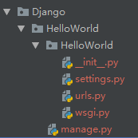
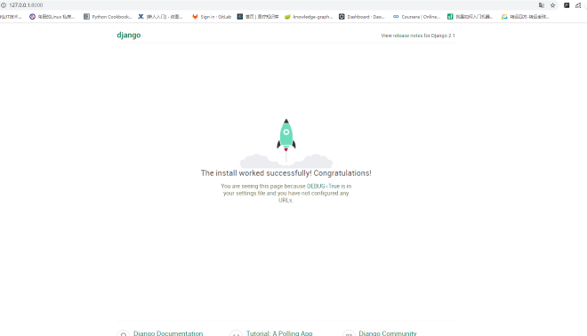
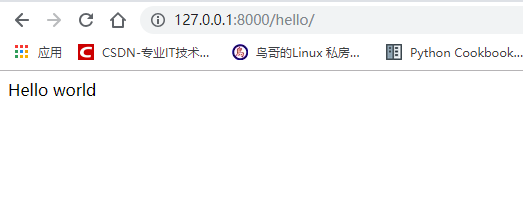
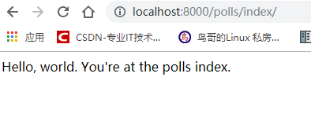
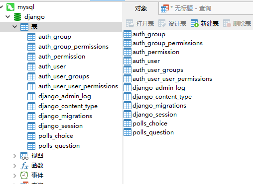

[官网地址](https://docs.djangoproject.com/zh-hans/2.0/intro/tutorial01/)

### 一、项目demo
#### 1.创建第一个项目
```
django-admin startproject HelloWorld
```



目录说明：
- HelloWorld: 项目的容器。
- manage.py: 一个实用的命令行工具，可让你以各种方式与该 Django 项目进行交互。
- HelloWorld/__init__.py: 一个空文件，告诉 Python 该目录是一个 Python 包。
- HelloWorld/settings.py: 该 Django 项目的设置/配置。
- HelloWorld/urls.py: 该 Django 项目的 URL 声明; 一份由 Django 驱动的网站"目录"。
- HelloWorld/wsgi.py: 一个 WSGI 兼容的 Web 服务器的入口，以便运行你的项目。

启动项目：
python manage.py runserver 0.0.0.0:8000



新建views.py

``` python

from django.http import HttpResponse


def index(request):
    return HttpResponse('Hello world') 
```

修改urls.py
```python
from django.contrib import admin
from django.urls import path

from web.Django.HelloWorld.HelloWorld import views

urlpatterns = [
    path('admin/', admin.site.urls),
    path('hello/', views.index)
]
```

打开网页
http://127.0.0.1:8000/hello/



#### 2. 新建一个应用

```
python manage.py startapp polls
```
在 polls 下新建urls.py
```
from django.urls import path

from . import views

urlpatterns = [
    path('index/', views.index, name='index'),
]
```
在views.py添加
```python
from django.shortcuts import render
from django.http import HttpResponse


def index(request):
    return HttpResponse("Hello, world. You're at the polls index.")
```
在 HelloWorld的urls内添加
```
path('polls/', include('polls.urls')),
```
查看网址http://localhost:8000/polls/index/



#### 3. 使用自带数据库创建模型
修改时区setting.py ：
```
TIME_ZONE = 'Asia/Shanghai'

USE_I18N = True

USE_L10N = True

USE_TZ = False
```
修改模型类models.py
```
from django.db import models


# class名字为表名
# CharField 表示char类型的字段
# question_text为字段名及数据库中的列名
class Question(models.Model):
    question_text = models.CharField(max_length=200)
    # 当前时间
    pub_date = models.DateTimeField('date published')


class Choice(models.Model):
    question = models.ForeignKey(Question, on_delete=models.CASCADE)
    choice_text = models.CharField(max_length=200)
    votes = models.IntegerField(default=0)
```
注册应用：
```
setting.py
INSTALLED_APPS = [
    'django.contrib.admin',
    'django.contrib.auth',
    'django.contrib.contenttypes',
    'django.contrib.sessions',
    'django.contrib.messages',
    'django.contrib.staticfiles',
    
    'polls.apps.PollsConfig',
]
```
数据迁移：

python manage.py makemigrations polls

查看迁移情况（查看创建表的sql语句）：

python manage.py sqlmigrate polls 0001

创建数据库：

python manage.py migrate

此时生成了一个db.sqlite3文件

### 3.连接mysql
安装pymysql
在__init__.py文件下添加
```
import pymysql
pymysql.install_as_MySQLdb()
```

执行

python manage.py makemigrations polls

python manage.py migrate



### 4.数据库操作

字段类型：
- models.AutoField　　自增列= int(11)  
  如果没有的话，默认会生成一个名称为 id 的列，如果要显示的自定义一个自增列，
  必须将给列设置为主键 primary_key=True。  
- models.CharField　　字符串字段   
  必须有max_length 参数 
- models.BooleanField　　布尔类型=tinyint(1)  
  不能为空，Blank=True
- models.ComaSeparatedIntegerField　　用逗号分割的数字=varchar  
  继承CharField，所以必须有 max_lenght 参数
- models.DateField　　日期类型 date  
  对于参数，auto_now =True则每次更新都会更新这个时间；
  auto_now_add 则只是第一次创建添加，之后的更新不再改变
- models.DateTimeField　　日期类型 datetime  
  同DateField的参数
- models.Decimal　　十进制小数类型= decimal  
  必须指定整数位max_digits和小数位decimal_places
- models.TextField　　字符串=longtext

```
def test(request):
    # 增
    # Student.objects.create(name='Sam', sex=0)
    #
    # obj = Student(name='Tom', sex=0)
    # obj.save()
    #
    # dic = {'name': "Jack", 'sex': 1}
    # Student.objects.create(**dic)

    # 查
    # 返回object
    # context1 = Student.objects.all()
    # # 查询某一列,返回dict
    # context2 = Student.objects.all().values('name')
    # # 查询某几列,返回dict
    # context3 = Student.objects.all().values_list('id', 'name')
    # # 返回object
    # context4 = Student.objects.get(id=1)
    # # 返回object
    # context5 = Student.objects.get(name='Sam')
    # return HttpResponse(context4)

    # 改
    Student.objects.filter(name='Sam').update(sex=1)

    obj = Student.objects.get(name='Tom')
    obj.sex = 1
    obj.save()

    # 删
    Student.objects.filter(name='Sam').delete()
```

### 5.接口

接口接收参数
```
path('<int:question_id>/', views.detail, name='detail'),

def detail(request, question_id):
    return HttpResponse("You're looking at question %s." % question_id)
```

跳转页面：
```
def index(request):
    latest_question_list = Question.objects.order_by('-pub_date')[:5]
    context = {'latest_question_list': latest_question_list}
    return render(request, 'polls/index.html', context)
```
注意：页面路径应为polls/templates/polls/index.html（默认情况）